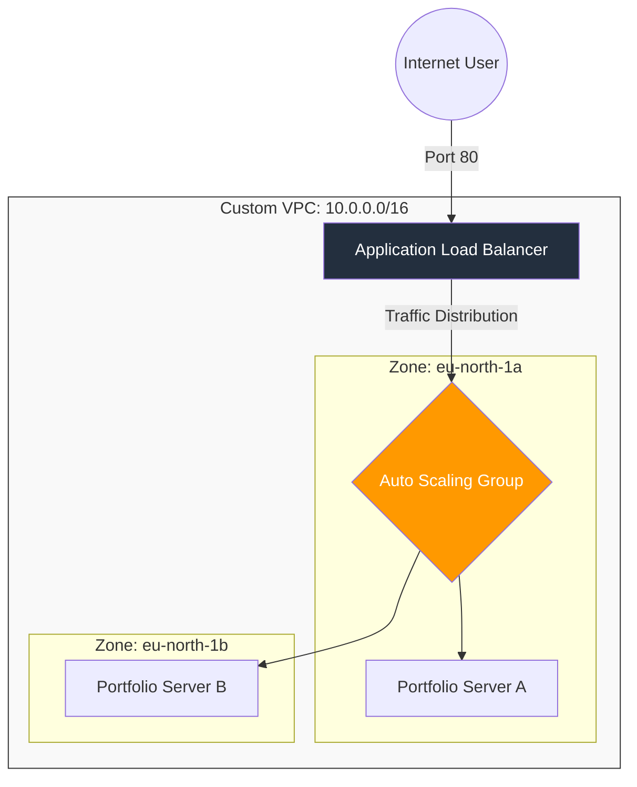

# ☁️ High-Availability Auto-Scaling Web Infrastructure
**AWS | Cloud Architecture | DevOps | Automation**

## 🚀 Project Overview
This project demonstrates a professional-grade, self-healing cloud architecture. I designed and deployed a web application that automatically scales its capacity based on traffic demand and ensures zero downtime by distributing resources across multiple data centers (Availability Zones).

---

## 🏗️ Architecture Diagram
Below is the infrastructure flow. (GitHub will automatically render this text into a visual diagram):

🛠️ Key Technical Features
1. Elasticity & Scalability
Auto Scaling Group (ASG): Configured to maintain a Desired Capacity of 2 instances.

Dynamic Scaling: Implemented a Target Tracking policy to scale up to 4 instances if average CPU utilization exceeds 50%.

2. Fault Tolerance & High Availability
Multi-AZ Deployment: Resources are spread across two different physical data centers.

Self-Healing: If an instance becomes unhealthy, the ASG automatically terminates it and launches a new one to maintain the desired state.

Health Checks: The Application Load Balancer (ALB) performs regular pings to ensure traffic is only sent to functional servers.

3. Security & Automation
IMDSv2: Used secure session tokens in the bootstrap scripts to fetch Instance IDs and Availability Zone metadata.

Security Groups: Followed the "Principle of Least Privilege" by only opening Port 80 for public web traffic and Port 22 for administrative SSH access.

Bootstrapping: Automated the entire server setup (Installing Apache, fetching metadata, and creating the HTML landing page) using EC2 User Data scripts.

📸 Proof of Concept

*Above: The webpage showing unique Server IDs and Data Center Zones.*

📂 Project Structure
scripts/user-data.sh: The Bash script used to automate the server configuration.

README.md: Full documentation of the architecture and project goals.

images/: Contains screenshots of the running AWS resources and the final output.

🎓 Skills Demonstrated
VPC Networking: Subnetting, Route Tables, and Internet Gateways.

Compute: Amazon EC2, AMI creation, and Launch Templates.

DevOps: Infrastructure automation and rolling updates.

Reliability: Load Balancing and Auto-Scaling strategies.

Author: [Pallavi Vankayala]
